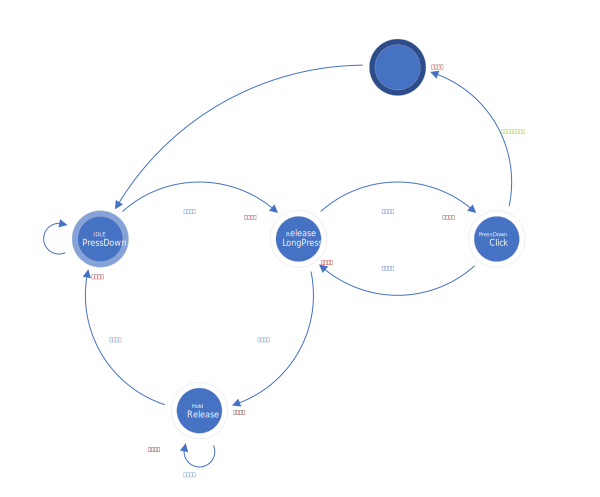

# FmlButton

## 目录

- [FmlButton](#fmlbutton)
  - [目录](#目录)
  - [前言](#前言)
  - [摘要](#摘要)
  - [属性](#属性)
    - [按键事件](#按键事件)
    - [按键状态转移图](#按键状态转移图)
  - [使用](#使用)
  - [扫码关注](#扫码关注)

## 前言

技术探讨QQ群：[528337130]，[加群备用链接]  
微信公众号：`嵌入式进阶之道`，`XiaoNingEngineer`  
GitHub地址：[小宁GitHub]  
Gitee地址：[小宁Gitee]

感谢[MultiButton]项目带来的帮助，感谢此项目的作者[0x1abin]

[528337130]: <https://jq.qq.com/?_wv=1027&k=yDw5eN6O>
[加群备用链接]: <https://jq.qq.com/?_wv=1027"&"k=yDw5eN6O>
[小宁GitHub]: <https://github.com/Fighting-XiaoNing>
[小宁Gitee]: <https://gitee.com/Fighting-XiaoNing>
[MultiButton]: <https://github.com/0x1abin/MultiButton>
[0x1abin]: <https://github.com/0x1abin>

## 摘要

FmlButton是处于功能模块层的按键驱动库;  
支持无限扩展按键，支持矩阵按键，查询或异步回调方式处理业务逻辑；  
提供`按下`、`释放`、`点击`、`长按`、`按住`操作，其中**点击**分为*单击*、*双击* ··· *255击*；

## 属性

### 按键事件

| 事件             | 描述 |
| ---------------- | ---- |
| EVENT_PRESS_DOWN | 按下 |
| EVENT_RELEASE    | 释放 |
| EVENT_CLICK      | 点击 |
| EVENT_LONG_PRESS | 长按 |
| EVENT_PRESS_HOLD | 按住 |

### 按键状态转移图



## 使用

1. 添加`FmlButton.h`和`FmlButton.c`文件至工程
2. 添加`HdlButton.h`和`HdlButton.c`文件，提供`hdlButton.Init()`和`hdlButton.ReadStatus()`方法

    ```C
    /**
    * @brief  按键初始化
    * @param  None
    * @retval None
    */
    static void HDL_Button_Init(void)
    {
        // @todo 初始化按键硬件
    }
    ```

    ```C
    /**
    * @brief  按键读取电平
    * @param  buttonID 按键号
    * @retval true - 有效电平
    * @retval false - 无效电平
    */
    static bool HDL_Button_ReadStatus(uint8_t buttonID)
    {
        bool bitstatus = false;

        switch (buttonID)
        {
            case 0:
                bitstatus = (P3 & 0x08) ? false : true; // P3.3低电平有效
                break;
            case 1:
                bitstatus = (P3 & 0x04) ? false : true; // P3.2低电平有效
                break;
            case 2:
                bitstatus = (P2 & 0x01) ? true : false; // P2.0高电平有效
                break;
            default:
                break;
        }
        return bitstatus;
    }
    ```

3. 定义按键对象

    ```C
    ButtonField_TypeDef button0 = {0};
    ButtonField_TypeDef button1 = {0};
    ```

4. 注册按键事件回调函数（**异步回调方式**）

    - 用一个注册一个，不想用就都不注册、转而使用查询方式

    ```C
    FML_Button_RegEventCallBack(&button0, EVENT_PRESS_DOWN, Btn0PressDown);
    FML_Button_RegEventCallBack(&button1, EVENT_CLICK, Btn1Click);
    ... ...
    ```

5. 初始化按键

    - 初始化顺序决定扫描顺序，先初始化则先扫描
    - 第四个实参要与`HDL_Button_ReadStatus(uint8_t buttonID)`内的case值一一对应

    ```C
    fmlButton.Init(&button0, hdlButton.Init, hdlButton.ReadStatus, 0);
    fmlButton.Init(&button1, hdlButton.Init, hdlButton.ReadStatus, 1);
    ```

6. 定时扫描按键（**异步回调方式**）

    ```C
    int main(void)
    {
        ...
        while (1)
        {
            if (5ms时间到)
            {
                fmlButton.Scan();
            }
        }
    }
    ```

7. 定时扫描按键+读取扫描事件（**查询方式**）

    ```C
    int main(void)
    {
        static uint8_t button0Event = 0;

        button0Event = EVENT_NONE_BTN;
        ...
        while (1)
        {
            if (5ms时间到)
            {
                fmlButton.Scan();
            }
            if (button0Event != fmlButton.GetEvent(button0))
            {
                button0Event = fmlButton.GetEvent(button0);
                switch (button0Event)
                {
                    case EVENT_PRESS_DOWN:
                        // @todo Something you want to do while Press Down.
                        break;
                    case EVENT_RELEASE:
                        // @todo Something you want to do while Release.
                        break;
                    ... ...
                    default:
                        break;
                }
            }
        }
    }
    ```

## 扫码关注

| QQ群二维码                 |   | 微信公众号二维码                     |
| :-----------------------: |---| :---------------------------------: |
|  |   |  |
